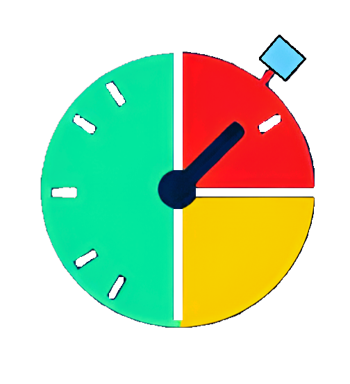
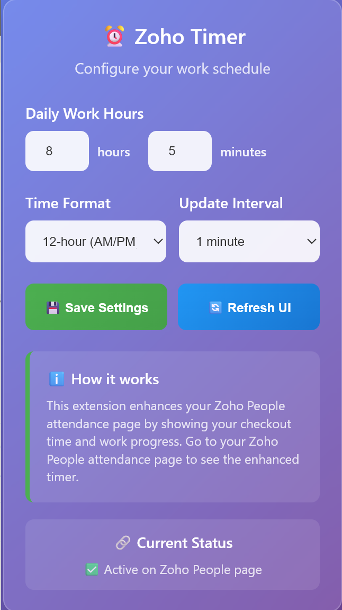
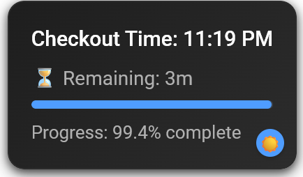

# ⏰ Zoho Timer - Chrome Extension

A Chrome extension that enhances the Zoho People attendance page with an intelligent timer showing checkout time, work progress, and overtime tracking.

  

## 🚀 Features

### ✨ Smart Timer Display
- **Checkout Time Prediction**: Shows exactly when you can leave based on your work hours
- **Real-time Progress**: Visual progress bar showing work completion percentage
- **Overtime Tracking**: Automatically detects and displays overtime hours
- **Remaining Time**: Shows how much time is left in your workday

### ⚙️ Customizable Settings
- **Flexible Work Hours**: Set your daily work hours and minutes (e.g., 8h 30m)
- **Time Format Options**: Choose between 12-hour (AM/PM) or 24-hour format
- **Update Intervals**: Configurable refresh rates (15s, 30s, 1m, 5m)
- **Theme Support**: Light and dark mode toggle

### 🎨 Modern UI
- **Responsive Design**: Clean, professional interface
- **Theme Toggle**: Switch between light and dark modes
- **Visual Feedback**: Color-coded status indicators
- **Smooth Animations**: Polished user experience

## 📦 Installation

### Method 1: Developer Mode (Recommended)
1. Download or clone this repository
2. Open Chrome and go to `chrome://extensions/`
3. Enable "Developer mode" in the top right corner
4. Click "Load unpacked" and select the extension folder
5. The extension will appear in your Chrome toolbar

### Method 2: Chrome Web Store
*Coming soon - Extension will be published to Chrome Web Store*

## 🔧 Setup & Usage

### Initial Setup
1. Click the extension icon in your Chrome toolbar
2. Configure your settings:
   - **Work Hours**: Set your daily work hours and minutes
   - **Time Format**: Choose 12-hour or 24-hour display
   - **Update Interval**: Select how often the timer updates
3. Click "💾 Save Settings"

### Using the Timer
1. Navigate to your Zoho People attendance page
2. Check in as usual
3. The enhanced timer will automatically appear showing:
   - Your predicted checkout time
   - Work progress percentage
   - Remaining time or overtime
   - Visual progress bar

### Settings Management
- **Save Settings**: Stores your preferences in Chrome sync storage
- **Refresh UI**: Reloads settings and updates the display
- **Theme Toggle**: Switch between light and dark modes (button in timer display)

## ⚡ Features in Detail

### Work Hours Configuration
- Set hours (0-24) and minutes (0-59) separately
- Automatic conversion to decimal hours for calculations
- Cross-validation ensures at least 1 minute is set
- Real-time validation with error feedback

### Time Format Support
- **12-hour format**: Shows times like "5:30 PM"
- **24-hour format**: Shows times like "17:30"
- Consistent formatting across all displays

### Progress Tracking
- Visual progress bar with smooth animations
- Percentage completion display
- Color-coded status (green for normal, red for overtime)
- Real-time updates based on your selected interval

### Theme System
- **Light Theme**: Clean, professional appearance
- **Dark Theme**: Easy on the eyes with custom color palette
- **Toggle Button**: Quick switching with visual feedback
- **Persistent Settings**: Theme preference saved automatically

## 🔄 Update Intervals

Choose how frequently the timer updates:
- **15 seconds**: Most responsive, higher battery usage
- **30 seconds**: Good balance (default)
- **1 minute**: Conservative, good for battery life
- **5 minutes**: Minimal updates, lowest resource usage

## 🎯 Target Audience

This extension is perfect for:
- **Zoho People users** who want better time tracking
- **Remote workers** needing precise time management
- **Employees** who want to optimize their work schedule
- **Teams** looking for consistent time tracking

## 🐛 Troubleshooting

### Extension Not Working
1. Ensure you're on a Zoho People attendance page
2. Check that the extension is enabled in Chrome
3. Try refreshing the page and clicking "🔄 Refresh UI"

### Timer Not Appearing
1. Verify you're logged into Zoho People
2. Make sure you've checked in for the day
3. Check browser console for error messages

### Settings Not Saving
1. Ensure Chrome sync is enabled
2. Check Chrome storage permissions
3. Try disabling and re-enabling the extension

## 🔮 Future Enhancements

- [ ] Break time tracking
- [ ] Weekly/monthly statistics
- [ ] Export time data
- [ ] Multiple work schedule support
- [ ] Notification system
- [ ] Integration with other time tracking tools

## 📄 License

This project is licensed under the MIT License - see the [LICENSE](LICENSE) file for details.

## 🤝 Contributing

Contributions are welcome! Please feel free to submit a Pull Request. For major changes, please open an issue first to discuss what you would like to change.

### Development Setup
1. Clone the repository
2. Make your changes
3. Test thoroughly on Zoho People pages
4. Submit a pull request

## 📞 Support

If you encounter any issues or have feature requests:
1. Check the troubleshooting section above
2. Open an issue on GitHub
3. Provide detailed information about your setup and the problem

## 🙏 Acknowledgments

- Zoho People for providing the platform
- Chrome Extension documentation and community
- All users who provide feedback and suggestions

## 📸 Screenshots

### Settings Popup

*Configure your work hours, time format, and update intervals*

### Timer Display on Zoho People  

*Enhanced timer showing checkout time and progress*

**Made with ❤️ for better time management** 